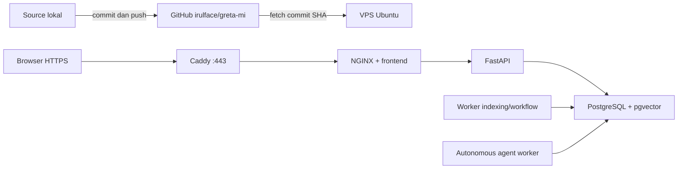

# Production deployment — mi.greta.id

Sumber production: **https://github.com/irulface/greta-mi**. Repo yang ditetapkan pengguna saat implementasi bersifat publik. Bootstrap membuat repo baru sebagai private bila nama tujuan belum ada; untuk repo yang sudah ada, visibility dipertahankan. File environment, database, dokumen unggahan, backup, virtualenv, dan kunci lokal tidak diunggah.

## Menjalankan deployment dari komputer Anda

Prasyarat lokal: Git, Python 3, OpenSSH, dan GitHub CLI (`gh`). Login sekali menggunakan akun yang dapat menulis ke repo:

```bash
gh auth login --hostname github.com --git-protocol https --web
```

Dari folder project:

```bash
# Pratinjau tanpa commit, push, koneksi SSH, atau perubahan server:
./scripts/deploy-production.sh --dry-run

# Upload source ke GitHub saja:
./scripts/publish-github.sh --repo irulface/greta-mi

# Upload perubahan, lalu deploy commit yang sama ke VPS:
./scripts/deploy-production.sh --repo irulface/greta-mi
```

Script memeriksa source dan seluruh history Git terhadap path privat, private key/token, serta nilai secret yang diketahui dari `.env` lokal; kemudian membuat commit dan push tanpa force. Script tidak mengunggah source yang belum committed. Remote GitHub diverifikasi memiliki commit tersebut sebelum membuka koneksi VPS. Pemeriksaan ini bukan pengganti secret scanner menyeluruh; jangan menaruh kredensial atau data organisasi pada source.

Saat deployment berlangsung, Anda diminta mengisi:

1. Hostname/IP VPS, default `mi.greta.id`; user SSH, default `root`; port SSH, default `22`.
2. Password VPS melalui prompt OpenSSH. User selain root juga diminta password `sudo` bila diperlukan. Password SSH tidak dicatat atau disimpan script. Host key diverifikasi oleh OpenSSH; jangan menerima fingerprint yang tidak cocok dengan informasi VPS Anda.
3. Pada instalasi pertama: **email/user admin aplikasi** dan password minimal 14 karakter, email sertifikat, user/nama database serta password database. Password database boleh dikosongkan untuk generate otomatis.
4. Pengaturan SMTP opsional: host, port, username, password, sender, dan SSL/STARTTLS. Default host `asia.emailarray.com`, port `465`, username/sender `admin@greta.id`, SSL; password tetap diminta di terminal dan tidak disalin dari komputer lokal.

Password dengan `$`, quote, `#`, backslash, dan tanda baca lain dipertahankan secara literal. Login aplikasi menggunakan **email**, sesuai implementasi auth Greta. Bootstrap Admin tidak dibuat ulang pada update dan password yang sudah tersimpan tidak direset.

Untuk VPS dengan SSH key:

```bash
./scripts/deploy-production.sh --host 203.0.113.10 --user ubuntu --port 22 \
  --identity ~/.ssh/id_ed25519
```

`203.0.113.10` di atas adalah contoh; ganti dengan IP VPS Anda. Domain aplikasi tetap `mi.greta.id`. Script hanya menyalin bootstrap kecil melalui SCP; seluruh source aplikasi di VPS diambil dari GitHub pada commit SHA yang telah diverifikasi. Jangan mengirim password lewat argumen command line atau chat.

## Persiapan VPS

- Ubuntu **22.04, 24.04, atau 26.04 LTS**, user root atau user dengan sudo. Sistem harus mempunyai Python 3 dan layanan SSH. Bootstrap memasang Git, Docker Engine/Compose bila belum tersedia, serta dependensi dasar.
- DNS A dan, jika digunakan, AAAA `mi.greta.id` harus menunjuk ke VPS. Pastikan port TCP **80/443** dapat diakses publik serta port SSH Anda tetap terbuka. UDP 443 opsional untuk HTTP/3. Bootstrap tidak mengubah firewall, DNS, atau SSH daemon.
- Port 80/443 harus tersedia. Bootstrap berhenti bila server pertama sudah memakai port tersebut; tidak menghentikan NGINX/Apache/aplikasi lain secara otomatis. Jika VPS sudah mempunyai reverse proxy perusahaan, integrasikan routing lebih dahulu.
- Sediakan kapasitas untuk build Node/Python, PostgreSQL, dokumen, image rilis lama, dan backup; monitoring kapasitas/retensi tetap tanggung jawab operator. Deployment melibatkan maintenance singkat pada update.
- Docker Compose **>=2.30** diperlukan untuk `env_file: format: raw`. Instalasi Docker mengikuti [APT resmi Docker untuk Ubuntu](https://docs.docker.com/engine/install/ubuntu/), tanpa convenience installer. Runtime lain yang konflik tidak dihapus otomatis.

## Topologi dan penyimpanan



Compose production terpisah di `deploy/compose.production.yaml`. Hanya Caddy mempublikasikan port host. API, database, web internal, dan kedua worker berada pada jaringan Docker privat. Caddy mengurus penerbitan/perpanjangan sertifikat serta redirect HTTP ke HTTPS, sesuai [Automatic HTTPS](https://caddyserver.com/docs/automatic-https).

API menunggu migrasi sukses; worker/web menunggu API sehat. Dependency menggunakan kondisi readiness sebagaimana [panduan startup Compose](https://docs.docker.com/compose/how-tos/startup-order/). Mode production mematikan demo login dan memakai cookie Secure/HTTP-only. Bootstrap memverifikasi mode ini melalui URL HTTPS, bukan hanya status container.

- `/opt/greta-mi/source.git`: cache source GitHub.
- `/opt/greta-mi/releases/<SHA>`: checkout commit immutable.
- `/opt/greta-mi/current`: symlink ke rilis terakhir yang lolos health check HTTPS.
- `/opt/greta-mi/deployment.json`: tahap deployment terakhir, kandidat, dan commit sebelumnya; tidak berisi password.
- `/etc/greta-mi/settings.json`: konfigurasi production dengan permission **0600**, direktori **0700**.
- `/etc/greta-mi/{app,db,bootstrap,edge}.env`: environment khusus per service dengan permission **0600**. Jangan menjalankan `source` terhadap file ini; formatnya adalah raw environment untuk Compose, bukan shell script.
- Docker volumes `greta-mi_postgres_data`, `greta-mi_app_data`, `greta-mi_caddy_data`, `greta-mi_caddy_config`: data persisten; tidak dihapus oleh bootstrap.

Database production memakai PostgreSQL 16 + pgvector pada container khusus. User `postgres` hanya untuk inisialisasi/backup; role aplikasi default `gretami` tidak superuser dan memiliki database `gretamidb`. Secret database superuser tidak diteruskan ke API. Master encryption key dan password database dibuat sekali dan dipertahankan saat update. Kehilangan konfigurasi saat volume masih ada menghentikan bootstrap agar key tidak dibuat ulang.

Untuk repo publik, VPS menggunakan clone HTTPS tanpa credential GitHub. Untuk repo privat, bootstrap menyiapkan SSH deploy key khusus VPS lalu meminta Anda menambahkan **public key** pada Settings → Deploy keys dengan akses baca saja. Private key tetap pada VPS. [GitHub deploy keys](https://docs.github.com/en/authentication/connecting-to-github-with-ssh/managing-deploy-keys) digunakan hanya untuk repo terkait; host key GitHub dipin ke [Ed25519 fingerprint resmi](https://docs.github.com/en/authentication/keeping-your-account-and-data-secure/githubs-ssh-key-fingerprints).

## Update, status, dan backup

Update dari komputer lokal menggunakan command deployment yang sama. Urutan: pemeriksaan source → commit/push → fetch SHA → build image baru → hentikan penulisan → backup → migrasi → start/readiness → verifikasi HTTPS → tandai rilis sukses.

Di VPS:

```bash
sudo greta-mi --action status
sudo greta-mi --action backup
sudo greta-mi --action stop
sudo greta-mi --action start
```

`backup` menghentikan web/API/worker sementara agar dump database dan file konsisten, lalu menjalankannya kembali. Backup sebelum update dilakukan otomatis di `/opt/greta-mi/backups/<timestamp>/`, berisi:

- `database.dump`: pg_dump format custom.
- `app-data.tar.gz`: dokumen dan file aplikasi.
- `configuration.tar.gz`: konfigurasi dan master key; **berisi secret** dan harus diperlakukan sebagai backup privat.
- `manifest.json`: commit sumber, checksum, serta tanda backup selesai.

Backup yang gagal tidak dianggap lengkap. Simpan salinan backup terenkripsi di lokasi terpisah dan tetapkan retensi; bootstrap tidak menghapus backup/rilis/image lama secara otomatis. Volume sertifikat tetap persisten dan Caddy dapat menerbitkan ulang sertifikat saat pemulihan.

Jika build/backup gagal sebelum migrasi, kode lama dipertahankan; jika backup sudah menghentikan writers, script mencoba menjalankannya kembali. Setelah migrasi mulai, script **tidak otomatis menjalankan kode versi lama** pada schema yang mungkin berubah. Deployment yang gagal HTTPS tidak ditandai sukses. Periksa `deployment.json`, DNS/port dan log, lalu jalankan kembali deployment setelah masalah diperbaiki. `start` ditolak ketika tahap deployment masih gagal/tidak selesai; gunakan alur deployment untuk validasi migrasi.

Untuk melihat log tanpa menampilkan environment:

```bash
sudo sh -c 'cd /opt/greta-mi/current && GRETA_RELEASE=$(basename "$(pwd -P)") \
  docker compose -p greta-mi -f deploy/compose.production.yaml logs --tail 100 api worker agent edge'
```

Jika pointer `current` belum ada, gunakan folder kandidat yang tercatat pada `deployment.json`. Jangan menggunakan `docker compose config` tanpa `--quiet`: output konfigurasi lengkap dapat berisi secret. Jangan menggunakan `down -v`, `volume rm`, force push, atau migration downgrade untuk recovery. Pemulihan ke versi sebelum migrasi memerlukan restore **database + file + konfigurasi** dari backup yang sama, lalu menjalankan commit yang tercatat di manifest; tidak ada destructive rollback otomatis.

## Data dan integrasi awal

Bootstrap menyiapkan instalasi production baru. Database `gretamidb`, dokumen, akun demo, SMTP password dan konfigurasi Azure/MCP dari localhost tidak ikut dipindahkan. Admin pertama masuk di **https://mi.greta.id**, lalu membuat pengguna Buyer/Analyst, taxonomy, dan integrasi organisasi. Migrasi data lokal ke VPS merupakan langkah terpisah dengan backup dan validasi scope; jangan menyalin database melalui GitHub.

`PUBLIC_APP_URL` otomatis menjadi `https://mi.greta.id`. SMTP dikonfigurasi dari input deployment; script tidak mengirim email percobaan. Azure, MCP, dan provider market dapat dikonfigurasi melalui Admin setelah deployment. Untuk allowlist host, tambahkan field `mcp_hosts`, `market_hosts`, atau `enterprise_hosts` pada settings.json secara aman di VPS, lalu jalankan deployment ulang. Perubahan password database pada settings.json saja tidak mengubah role PostgreSQL; rotasi perlu perubahan database yang sesuai. Mengubah bootstrap password juga tidak mereset password akun yang sudah ada.

## Pengujian

```bash
python3 -m unittest discover -s deploy/tests -v
./scripts/deploy-production.sh --dry-run
# Memerlukan Docker daemon; hanya memakai project/volume greta-ci-* sementara:
python3 deploy/tests/production_smoke.py
```

Workflow **Production deployment checks** pada GitHub menjalankan pengujian script dan membangun container production di Ubuntu. Smoke test mencakup migrasi, PostgreSQL non-superuser, frontend, production login, cookie Secure, CSRF, password dengan karakter khusus, dan restart. Workflow ini tidak terhubung ke VPS dan tidak melakukan deployment production atau pengiriman email. Uji DNS/TLS serta login SSH/sudo aktual tetap dilakukan saat Anda menjalankan deployment VPS.
